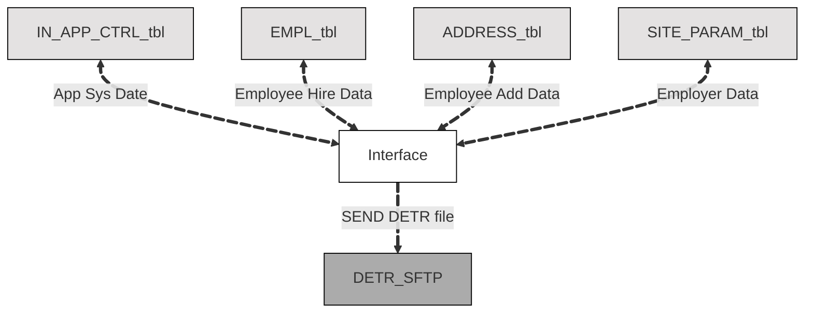

# Introduction (Vision)
To replace the COBOL-based HIB095 interface with a modernized Pentaho Data Integration (PDI) workflow that supports maintainability, flexibility, and modern ETL practices.

This interface is an outbound interface from the Advantage 4 ERP system to report new employees to the Department of Education Training and Rehab (DETR) for the purpose of enrolling that employee in Unemployment Insurance as federally required under US and Nevada law. 

## Table of Contents
1. [Business Need](#1-business-need)
2. [Occurance & Volume](#2-occurance--volume)
3. [Dependencies](#3-dependencies)
4. [Proposed High level Flow](#4-proposed-high-level-flow)
   * [I:O Diagram](#input--output-diagram)
5. [Key Differences](#5-key-differences-between-legacy-and-new)
6. [Source Data Specifications](#6-source-data-specifications)
   * [All Tables and Usage](#all-tables-and-use)
   * [All Tables and Fields and Their Usage](#all-tables-and-fields-and-their-use)
7. [Output Specifications](#7-output-specifications)
   * [Output File: `HIB0030.HIRE.FOLDED.txt`](#output-file)
      * [Output Layout](#output-layout)
   * [Purpose](#purpose)
      * [Output Mapping and Crosswalk](#output-mapping)
8. [Architecture and Implementation Notes](#8-architecture-and-implementation-notes)
9. [Questions and Follow Ups](#9-questions-and-follow-ups)
10. [Additional Documentation](#10-additional-documentation)

## 1. Business Need
The interface extracts records of new hires, re‑hires, and re‑instatements and delivers them to DETR (ESD) via SFTP. Downstream, DETR uses this file for unemployment insurance and workforce analytics. Terminations, job transfers, and address‑only updates are NOT handled by this program.

## 2. Occurance & Volume
The interface is executed daily during the nightly batch window.

## 3. Dependencies
* External Dependencies
    * Access to Advantage 4 HR tables
    * Access to DETR SFTP site

## 4. Proposed High-Level Flow
1. Query Today's New Hire... WHERE the Application System Date = Employee Hire Date
    * SELECT against related EMPL/EMPLR tables
    * WHERE `APPL_SYS_DT` = `HIRE_DT`
2. Format and Crosswalk Fields as needed
3. Output as Fixed Width Flat File
4. Cycle drops output file to DETR SFTP

### Input & Output Diagram


## 5. Key Differences between Legacy and New

| Aspect        | Legacy COBOL                        | Future Pentaho
| ---           | ---                                 | ---
| Data Source   | Advantage 2 flat files + DB lookups | Advantage 4 relational tables
| Orchestration | C-shell + multiple scripts          | Single PDI Job with rounded transforms
| Lookups       | COBOL &  COPYbooks                  | Table Input steps + Database Lookup steps
| CRLF          | UNIX fold + awk                     | PDI User Defined JavaScript transformations
| Delivery      | SFTP step in script                 | CGI cycle scripts

## 6. Source Data Specifications

### All Tables and Use
| Table            | Use          
| ---              | ---
| `EMPL`           | Employee Details; Reference Internal Employee ID to join to other tables
| `ADDRESS`        | Employee Address History; Active Address is WHERE EXPIRATION_DT = 31-DEC-99 OR 12/31/9999
| `SITE_PARAMETER` | Employer Details to include in the interface output
| `IN_APP_CTRL`    | Retrieve application system date; date to be used when querying for new employees created for the day

### All Tables and Fields and Their Use

| ADV4 Table        | Field            | Field Ref                | Transformation Notes    
| ---               | ---              | ---                      | ---
| `EMPL`            | EMPL_SSN         | ---                      | 1:1    
| `EMPL`            | EMPL_FIRST_NM    | ---                      | 1:1
| `EMPL`            | EMPL_MIDDLE_NM   | ---                      | 1:1
| `EMPL`            | EMPL_LAST_NM     | ---                      | 1:1
| `ADDRESS`         | STR_1_NM         | ---                      | WHERE EXPIRATION_DT = 31-DEC-99 || (12/31/9999)
| `ADDRESS`         | STR_2_NM         | ---                      | ^^
| `ADDRESS`         | CITY_NM          | ---                      | 1:1
| `ADDRESS`         | ST_CD            | ---                      | 1:1
| `ADDRESS`         | ZIP              | ---                      | 1:1
| `ADDRESS`         | CTRY_CD          | ---                      | 1:1
| `EMPL`            | BIRTH_DT         | ---                      | 1:1
| ??                |                  | ??                       |
| `SITE_PARAMETER`  | SITE_PARAMTER_CD | EMPLOYER FEDERAL TAX NO  | WHERE EXPIRATION_DT = 31-DEC-99 USE `SITE_PARAM_TEXT` from Field Ref
| `SITE_PARAMETER`  | SITE_PARAMTER_CD | EMPLOYER NAME            | ^^
| `SITE_PARAMETER`  | SITE_PARAMTER_CD | EMPLOYER STREET ADDRESS  | ^^
| `SITE_PARAMETER`  | SITE_PARAMTER_CD | EMPLOYER CITY            | ^^
| `SITE_PARAMETER`  | SITE_PARAMTER_CD | EMPLOYER STATE           | ^^
| `SITE_PARAMETER`  | SITE_PARAMTER_CD | EMPLOYER ZIP CODE PREFIX | ^^
| `SITE_PARAMETER`  | SITE_PARAMTER_CD | EMPLOYER ZIP CODE SUFFIX | ^^
| `SITE_PARAMETER`  | SITE_PARAMTER_CD | EMPLOYER COUNTRY CODE    | slice(-1) USA => US; Field length is constrained to two chars
| `IN_APP_CTRL`     | PARAM_NM         | APPL_SYS_DT              | Application System Date; used in new employee query of the day

## 7. Output Specifications

### Output File 
`HIB0030.HIRE.FOLDED.txt`

#### Output Layout
```
 01 HIRE-RECORD.
          05 HIRE-EMPLOYEE-SSN                  PIC X(09).
          05 HIRE-EMPLOYEE-FIRST-NAME           PIC X(16).
          05 HIRE-EMPLOYEE-MIDDLE-NAME          PIC X(16).
          05 HIRE-EMPLOYEE-LAST-NAME            PIC X(30).
          05 HIRE-EMPLOYEE-STREET-1             PIC X(40).
          05 HIRE-EMPLOYEE-STREET-2             PIC X(40).
          05 HIRE-EMPLOYEE-STREET-3             PIC X(40).
          05 HIRE-EMPLOYEE-CITY                 PIC X(25).
          05 HIRE-EMPLOYEE-STATE                PIC X(02).
          05 HIRE-EMPLOYEE-ZIP-1                PIC X(05).
          05 HIRE-EMPLOYEE-ZIP-2                PIC X(04).
          05 HIRE-EMPLOYEE-COUNTRY              PIC X(02).
          05 HIRE-EMPLOYEE-CNTRY-NAME           PIC X(25).
          05 HIRE-EMPLOYEE-CNTRY-ZIP            PIC X(15).
          05 HIRE-BIRTH-DATE-YYYYMMDD           PIC X(08).
          05 HIRE-DATE-YYYYMMDD                 PIC X(08).
          05 HIRE-STATE                         PIC X(02).
          05 HIRE-EMPLOYER-FED-EIN              PIC X(09).
          05 HIRE-EMPLOYER-STATE-EIN            PIC X(12).
          05 HIRE-EMPLOYER-NAME                 PIC X(45).
          05 HIRE-EMPLOYER-STREET-1             PIC X(40).
          05 HIRE-EMPLOYER-STREET-2             PIC X(40).
          05 HIRE-EMPLOYER-STREET-3             PIC X(40).
          05 HIRE-EMPLOYER-CITY                 PIC X(25).
          05 HIRE-EMPLOYER-STATE                PIC X(02).
          05 HIRE-EMPLOYER-ZIP-1                PIC X(05).
          05 HIRE-EMPLOYER-ZIP-2                PIC X(04).
          05 HIRE-EMPLOYER-COUNTRY              PIC X(02).
          05 HIRE-EMPLOYER-CNTRY-NAME           PIC X(25).
          05 HIRE-EMPLOYER-CNTRY-ZIP            PIC X(15).
          05 HIRE-EMPL-OPT-STREET-1             PIC X(40).
          05 HIRE-EMPL-OPT-STREET-2             PIC X(40).
          05 HIRE-EMPL-OPT-STREET-3             PIC X(40).
          05 HIRE-EMPL-OPT-CITY                 PIC X(25).
          05 HIRE-EMPL-OPT-STATE                PIC X(02).
          05 HIRE-EMPL-OPT-ZIP-1                PIC X(05).
          05 HIRE-EMPL-OPT-ZIP-2                PIC X(04).
          05 HIRE-EMPL-OPT-COUNTRY              PIC X(02).
          05 HIRE-EMPL-OPT-CNTRY-NAME           PIC X(25).
          05 HIRE-EMPL-OPT-CNTRY-ZIP            PIC X(15).
          05 HIRE-FEDERAL-FILLER                PIC X(50).
          05 HIRE-STATE-FILLER                  PIC X(101).
```

### Purpose
Federal law requires all employers to report certain information on newly hired employees to a designated state agency.

A newly hired employee is defined as:
* Someone not previously employed by the employer; or
* A person being rehired who was previously employed by the employer but has separated from the employer for at least 60 consecutive days.

In Nevada, new hire information must be reported to the Employment Security Division of the Department of Employment, Training and Rehabilitation.

New hire information is used by the Child Support Enforcement Program of the Nevada Division of Welfare and Supportive Services and the National Directory of New Hires to locate parents who are not paying legally required child support.

Required information must be reported within 20 days of hire (or rehire after at least 60 consecutive days of separation from employment).

#### Output Mapping and CrossWalk
* *R-Required* 
* *O-Optional*

| Flat File Field      | Len| ADV4 Table        | ADV4 Field              | Req | Transformation     
| ---                  | ---| ---               | ---                     | --  | ---
| EMPLOYEE-SSN         |  9 | `EMPL`            | EMPL_SSN                |  R  | 1:1    
| EMPLOYEE-FIRST-NAME  | 16 | `EMPL`            | EMPL_FIRST_NM           |  R  | 1:1
| EMPLOYEE-MIDDLE-NAME | 16 | `EMPL`            | EMPL_MIDDLE_NM          |  O  | 1:1
| EMPLOYEE-LAST-NAME   | 30 | `EMPL`            | EMPL_LAST_NM            |  R  | 1:1
| EMPLOYEE-STREET-1    | 40 | `ADDRESS`         | STR_1_NM                |  R  | WHERE EXPIRATION_DT = 31-DEC-99 || (12/31/9999)
| EMPLOYEE-STREET-2    | 40 | `ADDRESS`         | STR_2_NM                |  O  |
| EMPLOYEE-STREET-3    | 40 | ---               | ---                     |  O  | ---
| EMPLOYEE-CITY        | 25 | `ADDRESS`         | CITY_NM                 |  R  |
| EMPLOYEE-STATE       |  2 | `ADDRESS`         | ST_CD                   |  R  |
| EMPLOYEE-ZIP-1       |  5 | `ADDRESS`         | ZIP                     |  R  |
| EMPLOYEE-ZIP-2       |  4 | ---               | ---                     |  O  | ---
| EMPLOYEE-COUNTRY     |  2 | `ADDRESS`         | CTRY_CD                 |  R  |
| EMPLOYEE-CNTRY-NAME  | 25 | ---               | ---                     |  O  | ---
| EMPLOYEE-CNTRY-ZIP   | 15 | ---               | ---                     |  O  | ---
| BIRTH-DATE-YYYYMMDD  |  8 | `EMPL`            | BIRTH_DT                |  O  | 1:1
| HIRE-DATE-YYYYMMDD   |  8 | ??                | ??                      |  R  |
| HIRE-STATE           |  2 | ---               | ---                     |  O  |
| EMPLOYER-FED-EIN     |  9 | `SITE_PARAMETER`  | EMPLOYER FEDERAL TAX NO |  R  | WHERE EXPIRATION_DT = 31-DEC-99 USE `SITE_PARAM_TEXT`
| EMPLOYER-STATE-EIN   | 12 | `SITE_PARAMETER`  | ---                     |  O  |
| EMPLOYER-NAME        | 45 | `SITE_PARAMETER`  | EMPLOYER NAME           |  R  |
| EMPLOYER-STREET-1    | 40 | `SITE_PARAMETER`  | EMPLOYER STREET ADDRESS |  R  |
| EMPLOYER-STREET-2    | 40 | `SITE_PARAMETER`  | ---                     |  O  |
| EMPLOYER-STREET-3    | 40 | `SITE_PARAMETER`  | ---                     |  O  |
| EMPLOYER-CITY        | 25 | `SITE_PARAMETER`  | EMPLOYER CITY           |  R  |
| EMPLOYER-STATE       |  2 | `SITE_PARAMETER`  | EMPLOYER STATE          |  R  |
| EMPLOYER-ZIP-1       |  5 | `SITE_PARAMETER`  | EMPLOYER ZIP CODE PREFIX|  R  |
| EMPLOYER-ZIP-2       |  4 | `SITE_PARAMETER`  | EMPLOYER ZIP CODE SUFFIX|  O  |
| EMPLOYER-COUNTRY     |  2 | `SITE_PARAMETER`  | EMPLOYER COUNTRY CODE   |  R  | slice(-1) USA => US
| EMPLOYER-CNTRY-NAME  | 25 | ---               | ---                     |  O  | ---
| EMPLOYER-CNTRY-ZIP   | 15 | ---               | ---                     |  O  | ---
| EMPL-OPT-STREET-1    | 40 | ---               | ---                     |  O  | ---
| EMPL-OPT-STREET-2    | 40 | ---               | ---                     |  O  | ---
| EMPL-OPT-STREET-3    | 40 | ---               | ---                     |  O  | ---
| EMPL-OPT-CITY        | 25 | ---               | ---                     |  O  | ---
| EMPL-OPT-STATE       |  2 | ---               | ---                     |  O  | ---
| EMPL-OPT-ZIP-1       |  5 | ---               | ---                     |  O  | ---
| EMPL-OPT-ZIP-2       |  4 | ---               | ---                     |  O  | ---
| EMPL-OPT-COUNTRY     |  2 | ---               | ---                     |  O  | ---
| EMPL-OPT-CNTRY-NAME  | 25 | ---               | ---                     |  O  | ---
| EMPL-OPT-CNTRY-ZIP   | 15 | ---               | ---                     |  O  | ---
| FEDERAL-FILLER       | 50 | ---               | ---                     |  O  | ---
| STATE-FILLER         |101 | ---               | ---                     |  O  | ---

## 8. Architecture and Implementation Notes

## 9. Questions and Follow Ups
1. What is the mapping for `HIRE-DATE-YYYYMMDD`? The Requirement for NUI is Hire Date and if it's a returning employee (meaning they seperated over 60 days ago), then we'd have a new Hire Date for them.

## 10. Additional Documentation
[NV UI Reporting FTP Specs](https://ui.nv.gov/ESSHTML/new_hire_online_reporting.htm#Online_Submission)